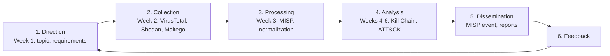

# Week 1 — Cyber Threat Intelligence Fundamentals

> **Group topic:** Lazarus Group (MITRE ATT&CK **G0032**)
> **Case study used throughout the project:** WannaCry ransomware, May 2017 (MITRE ATT&CK **S0366**)

**Syllabus tasks (section 3.3, Week 1):**
1. Create a glossary of key CTI terms.
2. Classify different types of threats and their sources.

---

## 1. Why Lazarus Group, and why WannaCry

Lazarus Group is a North Korean state-sponsored threat group attributed to the
Reconnaissance General Bureau (RGB). MITRE says it has been active since at least 2009
([MITRE G0032](https://attack.mitre.org/groups/G0032/)). It is known by several names,
depending on the vendor: *HIDDEN COBRA* (US government), *ZINC* / *Diamond Sleet* (Microsoft),
*Labyrinth Chollima* (CrowdStrike), *Guardians of Peace*. MITRE also notes that
"Lazarus" is often used as an **umbrella term** for several North Korean units, such as
APT38 (financial theft) and Andariel.

Lazarus is unusual because it combines **espionage, sabotage and large-scale financial theft**.
This makes it a good subject for CTI: one actor covers almost every threat category.

We chose **WannaCry** as our deep-dive case because:
- it is the best-documented Lazarus operation (public IOCs, government attribution, court documents);
- its IOCs are freely available, so we can use them safely in later weeks (VirusTotal, MISP, Sigma, ATT&CK);
- it is a clear example of a vulnerability (MS17-010) turning into a global incident.

### Lazarus Group — key operations

| Year | Operation | Type | Impact | Attribution source |
|---|---|---|---|---|
| 2014 | Sony Pictures Entertainment hack | Destructive (wiper) + data leak | Terabytes of data leaked, systems wiped | FBI (Dec 2014); US DOJ complaint vs. Park Jin Hyok (2018) |
| 2016 | Bangladesh Bank SWIFT heist | Financial theft | US$81 M stolen (US$951 M attempted) | US DOJ complaint (2018) |
| 2017 | **WannaCry** | Ransomware worm | 300,000+ computers in 150 countries; NHS disruption (~£92 M) | US & UK governments (Dec 2017); US DOJ (Sep 2018) |
| 2018→ | AppleJeus | Trojanized crypto-trading apps | Theft from crypto exchanges | CISA advisory AA21-048A |
| 2020→ | Operation Dream Job | Espionage via fake job offers | Defense/aerospace targets | MITRE ATT&CK campaign C0022 |
| 2022 | Ronin Bridge (Axie Infinity) | Crypto theft | ~US$620 M | FBI statement (Apr 2022) |
| 2023 | 3CX supply-chain compromise | Supply chain | Trojanized VoIP desktop client | Mandiant (UNC4736, DPRK-nexus) |
| 2025 | Bybit exchange | Crypto theft | ~US$1.5 B, the largest crypto theft ever recorded | FBI PSA (Feb 2025, "TraderTraitor") |

The trend shows that the group's focus moved from **sabotage and espionage → financial gain**,
mainly cryptocurrency, to fund the state.

---

## 2. Glossary of key CTI terms

| # | Term | Definition | Example from our topic |
|---|---|---|---|
| 1 | **Cyber Threat Intelligence (CTI)** | Evidence-based knowledge about threats (context, mechanisms, indicators, implications) that supports security decisions | This whole project: turning public WannaCry data into decisions (patch SMB, block IOCs) |
| 2 | **Intelligence lifecycle** | Direction → Collection → Processing → Analysis → Dissemination → Feedback | Weeks 1–3 of this project follow these phases (see diagram below) |
| 3 | **Strategic intelligence** | High-level, non-technical view of threats for executives | "DPRK steals crypto to fund the state; financial sector is a target" |
| 4 | **Operational intelligence** | Information about specific campaigns: who, when, how | WannaCry campaign of 12–15 May 2017, spread via SMB |
| 5 | **Tactical intelligence** | Adversary TTPs used by defenders to build detections | WannaCry deletes shadow copies with `vssadmin` (T1490) |
| 6 | **Technical intelligence** | Specific, short-lived artifacts: hashes, IPs, domains | SHA256 `ed01ebfb…41aa`, kill-switch domain |
| 7 | **Threat actor** | An individual or group that carries out malicious cyber activity | Lazarus Group (G0032) |
| 8 | **APT (Advanced Persistent Threat)** | A well-resourced, usually state-backed actor that runs long-term targeted operations | Lazarus is a DPRK APT |
| 9 | **TTP (Tactics, Techniques, Procedures)** | How an adversary operates: the goal (tactic), the method (technique), the specific implementation (procedure) | Tactic *Lateral Movement* → Technique T1210 → Procedure: EternalBlue over SMB/445 |
| 10 | **IOC (Indicator of Compromise)** | An observable artifact showing that a system was compromised | WannaCry hashes, `.onion` C2 addresses, Bitcoin wallets |
| 11 | **IOA (Indicator of Attack)** | A behavioral sign of an attack in progress, independent of specific artifacts | A process running `vssadmin delete shadows /all /quiet` |
| 12 | **Pyramid of Pain** | Model (D. Bianco) ranking indicators by how costly they are for the attacker to change: hashes < IPs < domains < artifacts < tools < TTPs | Blocking a WannaCry hash is trivial to bypass; detecting SMB-exploit behavior is not |
| 13 | **Diamond Model** | Describes an intrusion with four linked features: Adversary, Capability, Infrastructure, Victim | Lazarus → WannaCry/EternalBlue → Tor C2 + BTC wallets → unpatched Windows hosts |
| 14 | **Cyber Kill Chain** | Lockheed Martin's 7-stage intrusion model (Recon → Actions on Objectives) | Covered in Week 4 |
| 15 | **MITRE ATT&CK** | Knowledge base of adversary tactics and techniques, based on real-world observations | G0032 (group), S0366 (software) |
| 16 | **Attribution** | Identifying who is responsible for an attack, with a stated confidence level | US/UK attributed WannaCry to DPRK in Dec 2017 |
| 17 | **OSINT** | Intelligence collected from publicly available sources | VirusTotal, Shodan, vendor reports (Week 2) |
| 18 | **TLP (Traffic Light Protocol) 2.0** | Sharing labels: `TLP:RED`, `TLP:AMBER+STRICT`, `TLP:AMBER`, `TLP:GREEN`, `TLP:CLEAR` (TLP:WHITE was renamed CLEAR in 2022) | Our MISP event is `tlp:clear`: public data only |
| 19 | **STIX / TAXII** | STIX is a standard format for describing threat intel; TAXII is the protocol for exchanging it | MISP can export our event as STIX 2.1 |
| 20 | **MISP** | Open-source threat intelligence platform for storing, correlating and sharing IOCs | Week 3 deployment |
| 21 | **Vulnerability / CVE** | A weakness in software, and its public identifier | CVE-2017-0144 (SMBv1, EternalBlue) |
| 22 | **Exploit** | Code that uses a vulnerability to achieve an effect | EternalBlue, leaked by the Shadow Brokers in April 2017 |
| 23 | **C2 (Command and Control)** | Infrastructure an attacker uses to communicate with implants | WannaCry used Tor hidden services |
| 24 | **Kill switch** | A condition that stops malware from executing | WannaCry stopped if its hard-coded domain answered; registered by Marcus Hutchins on 12 May 2017 |
| 25 | **Sinkhole** | Redirecting malicious domain traffic to a server controlled by defenders | The kill-switch domain became a sinkhole, which also measured infections |

### CTI lifecycle as applied in this project

---

## 3. Classification of threats and their sources

### 3.1 By threat actor type (who is behind the threat)

| Actor type | Motivation | Typical capability | Example | Relevance to Lazarus |
|---|---|---|---|---|
| **Nation-state / APT** | Espionage, sabotage, geopolitics, revenue for sanctioned regimes | Very high: custom malware, 0-days, supply-chain attacks | Lazarus, APT28, APT29 | ✅ Lazarus *is* this category |
| **Cybercriminals** | Financial profit | Medium–high; ransomware-as-a-service | LockBit, Conti | ⚠️ Lazarus uses criminal *methods* (ransomware, theft) for state goals, which blurs the line |
| **Hacktivists** | Ideology, publicity | Low–medium; DDoS, defacement | Anonymous, pro-state DDoS groups | ⚠️ "Guardians of Peace" (Sony 2014) posed as hacktivists; this was a false flag |
| **Insiders** | Revenge, money, negligence | Legitimate access | Disgruntled employee | ⚠️ DPRK IT workers hired under false identities act as insiders |
| **Script kiddies / opportunists** | Curiosity, reputation | Low; reuse public tools | — | ❌ |

### 3.2 By threat type / technique (what happens)

| Threat type | Description | Lazarus / WannaCry example | ATT&CK reference |
|---|---|---|---|
| **Ransomware** | Encrypts data and demands payment | WannaCry, US$300–600 in Bitcoin | T1486 Data Encrypted for Impact |
| **Worm / self-propagating malware** | Spreads without user interaction | WannaCry scanned for SMB/445 and exploited it | T1210 Exploitation of Remote Services |
| **Exploitation of unpatched vulnerability** | Uses a known CVE on unpatched systems | CVE-2017-0144; the patch MS17-010 was released 2 months *before* the attack | T1210 |
| **Destructive malware (wiper)** | Destroys data or systems | Sony Pictures 2014 (Destover) | T1485 Data Destruction |
| **Financial theft / fraud** | Direct theft of money or crypto | Bangladesh Bank (SWIFT), Ronin, Bybit | T1657 Financial Theft |
| **Supply-chain compromise** | Trojanizing trusted software | 3CX (2023), AppleJeus | T1195.002 |
| **Social engineering / phishing** | Tricking people into running code or giving access | Operation Dream Job (fake LinkedIn job offers) | T1566 Phishing |
| **Espionage** | Stealing sensitive information | Defense and aerospace targets | TA0009 Collection |

### 3.3 By source of the threat (where it comes from)

| Source | Description | Example |
|---|---|---|
| **External** | Attacker outside the organization | Lazarus exploiting internet-exposed SMB |
| **Internal** | Employees, contractors, fake remote hires | DPRK IT-worker schemes |
| **Third-party / supply chain** | A trusted vendor or software update | 3CX desktop app |
| **Environmental / technical debt** | Legacy, unpatched or misconfigured systems | NHS Windows 7/XP machines with SMBv1 enabled |

### 3.4 Sources of threat *intelligence* (where we learn about threats)

| Source type | Open / Closed | Examples used in this project | Reliability |
|---|---|---|---|
| Government advisories and legal documents | Open | US DOJ complaint (2018), CISA/US-CERT alerts, UK NCSC | High |
| Knowledge bases | Open | MITRE ATT&CK G0032 / S0366 | High |
| Vendor technical reports | Open | Elastic, Kaspersky, Symantec, Mandiant | High |
| Malware repositories and scanners | Open (partly commercial) | VirusTotal | Medium–high |
| Internet scanners | Open (partly commercial) | Shodan | Medium |
| Link-analysis tools | Open / commercial transforms | Maltego CE | Depends on the transform data |
| Sharing communities and feeds | Semi-closed | MISP communities, CIRCL OSINT feed | High (curated) |
| Closed sources | Closed | Commercial CTI feeds, ISACs, dark-web monitoring | Not used (no access) |

---

## 4. Link to the current threat landscape (ENISA)

The syllabus recommends the **ENISA Threat Landscape (ETL)** report. The ETL 2025 report
(published 1 October 2025, period July 2024 – June 2025, 4,875 incidents) states that:
- **ransomware remains the most impactful threat** in the EU, the category WannaCry belongs to;
- **phishing (60%)** and **vulnerability exploitation (21.3%)** are the main initial-access vectors.
  WannaCry is a textbook case of the second;
- **state-aligned groups** intensified their operations, which matches Lazarus's continuing activity.

ENISA published the **ETL 2026** edition on 22 September 2026 (reporting period: calendar year 2025).

---

## Sources

- MITRE ATT&CK — Lazarus Group G0032: https://attack.mitre.org/groups/G0032/
- MITRE ATT&CK — WannaCry S0366: https://attack.mitre.org/software/S0366/
- Microsoft Security Bulletin MS17-010: https://learn.microsoft.com/en-us/security-updates/securitybulletins/2017/ms17-010
- US DOJ — Park Jin Hyok criminal complaint (6 Sep 2018): https://www.justice.gov/opa/pr/north-korean-regime-backed-programmer-charged-conspiracy-conduct-multiple-cyber-attacks-and
- CISA — AppleJeus advisory AA21-048A: https://www.cisa.gov/news-events/cybersecurity-advisories/aa21-048a
- FBI — Bybit PSA (Feb 2025): https://www.ic3.gov/PSA/2025/PSA250226
- ENISA Threat Landscape 2025: https://www.enisa.europa.eu/publications/enisa-threat-landscape-2025
- ENISA Threat Landscape 2026: https://www.enisa.europa.eu/publications/enisa-threat-landscape-2026
- FIRST — TLP 2.0: https://www.first.org/tlp/
- Recorded Future — *The Threat Intelligence Handbook* (course reading)
- D. Bianco — *The Pyramid of Pain* (2013)
