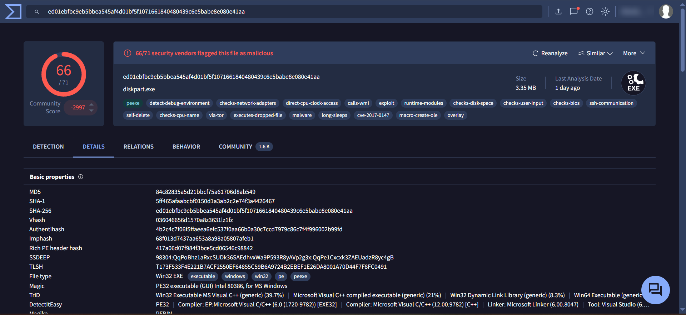
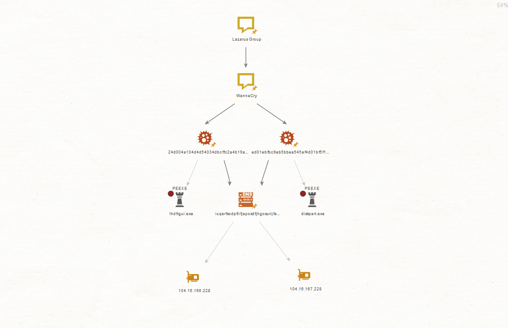
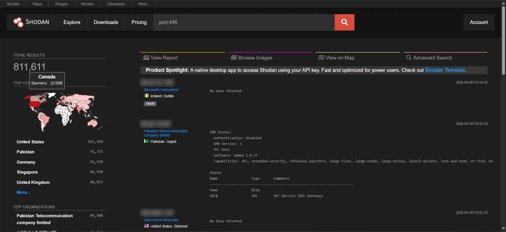
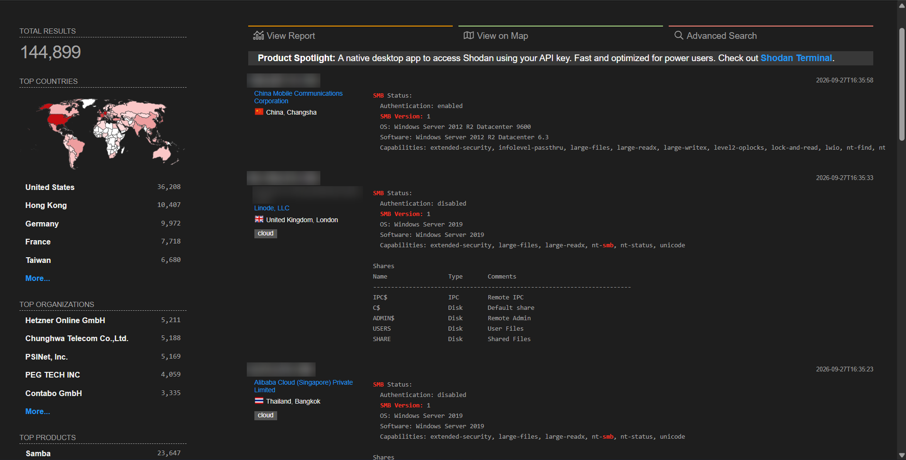
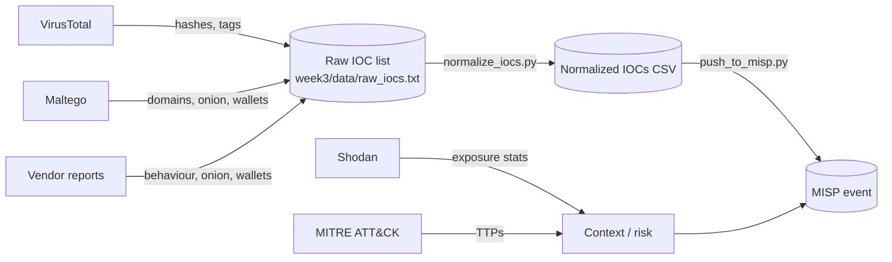

# Week 2 — Data Collection Process: Lazarus Group / WannaCry

**Syllabus tasks (section 3.3, Week 2):**
1. Perform OSINT data collection using **Shodan, VirusTotal and Maltego**.
2. Develop a data source mapping for analysis.

**Collection requirements** (from Week 1, the *Direction* phase):

| # | Intelligence question | Tool |
|---|---|---|
| CR-1 | Which file artifacts identify WannaCry, and how well do AV engines detect them? | VirusTotal |
| CR-2 | What infrastructure (domains, Tor C2, wallets) does WannaCry use, and how is it linked to Lazarus? | Maltego (+ VirusTotal relations) |
| CR-3 | Is the attack surface WannaCry exploited (SMBv1 on TCP/445) still exposed on the internet today? | Shodan |

**Ethical rules we followed:** passive collection only. We did not connect to any host, did not download
or run malware samples, and redacted IP addresses in the screenshots.

---

## 1. Open vs. closed sources (lecture topic)

| | Open source (OSINT) | Closed source |
|---|---|---|
| Access | Public, free or low cost | Paid subscriptions, membership, NDA |
| Examples | VirusTotal (public), Shodan, MITRE ATT&CK, vendor blogs, government advisories | Commercial CTI feeds, ISAC sharing groups, incident-response data, dark-web monitoring |
| Pros | Anyone can verify it; large volume | Curated, often earlier and more context |
| Cons | Noisy, may be outdated, adversaries can see it too | Cost, sharing restrictions (TLP) |
| Used here | ✅ all our data | ❌ not available to students |

---

## 2. VirusTotal — malware sample analysis (CR-1)

**Search performed:** the term `WannaCry` returns hundreds of tagged samples. We analysed the
**encryptor component** (dropped as `tasksche.exe` by the worm).

| Field | Value |
|---|---|
| SHA256 | `ed01ebfbc9eb5bbea545af4d01bf5f1071661840480439c6e5babe8e080e41aa` |
| SHA1 | `5ff465afaabcbf0150d1a3ab2c2e74f3a4426467` |
| MD5 | `84c82835a5d21bbcf75a61706d8ab549` |
| Detection ratio | **66 / 71** security vendors flagged the file as malicious |
| Name on VirusTotal | `diskpart.exe` (a disguise as a legitimate Windows tool; known WannaCry name: `tasksche.exe`) |
| File type / size | Win32 EXE (PE32, MS Visual C++ 6.0), 3.35 MB |
| Relevant tags | `exploit`, `malware`, `cve-2017-0147`, `via-tor`, `executes-dropped-file`, `self-delete`, `calls-wmi` |
| Contacted domains | 39 domains observed in sandbox runs (Relations tab) |

**Interpretation**
- 66/71 detections mean that **hash-based detection of this 2017 sample is trivial today**. That puts
  it at the bottom of the *Pyramid of Pain*: a recompiled variant would have a new hash.
- `cve-2017-0147` links the sample to the MS17-010 family of SMBv1 flaws (EternalBlue itself is
  CVE-2017-0144). The exploit code is carried by the **worm/dropper** component, so we also recorded
  the dropper hash for pivoting:

| Component | File name | SHA256 | MD5 |
|---|---|---|---|
| Worm / dropper (exploits SMB, checks kill switch) | `mssecsvc.exe` | `24d004a104d4d54034dbcffc2a4b19a11f39008a575aa614ea04703480b1022c` | `db349b97c37d22f5ea1d1841e3c89eb4` |
| Encryptor (analysed above) | `tasksche.exe` | `ed01ebfbc9eb5bbea545af4d01bf5f1071661840480439c6e5babe8e080e41aa` | `84c82835a5d21bbcf75a61706d8ab549` |

- `via-tor` confirms Tor-based C2 communication (ATT&CK T1090.003 Multi-hop Proxy).

---

## 3. Maltego — link analysis (CR-2)

**Tool:** Maltego (free Community Edition) with the *Standard Transforms* and the
*VirusTotal Public API* transform hub (free VirusTotal API key).

**Method**
1. Created a new graph. Added **Lazarus Group** and **WannaCry** as *Phrase* entities and linked them
   (Lazarus → WannaCry).
2. Added both SHA256 hashes (dropper + encryptor) as *Hash* entities and linked them to WannaCry.
3. Ran VirusTotal transforms on the hashes to find the file names under which the samples were submitted
   and their contacted infrastructure.
4. Linked both hashes to the kill-switch domain `iuqerfsodp9ifjaposdfjhgosurijfaewrwergwea.com` and ran
   `To IP Address [DNS]` on it to see where the sinkhole resolves today.
5. The three hard-coded Bitcoin wallets and five Tor `.onion` C2 addresses (source: Elastic technical
   analysis) were recorded in the table below and passed to Week 3 as IOCs.

**Findings**

| Entity type | Value | Meaning |
|---|---|---|
| File name (dropper) | `lhdfrgui.exe` | Name under which the dropper hash `24d004a1…` was submitted to VirusTotal (known WannaCry name: `mssecsvc.exe`) |
| File name (encryptor) | `diskpart.exe` | Encryptor hash `ed01ebfb…` disguised as a legitimate Windows tool (known name: `tasksche.exe`) |
| Domain (kill switch) | `iuqerfsodp9ifjaposdfjhgosurijfaewrwergwea.com` | Linked to **both** hashes. The worm stops if this domain answers, so it is now kept alive as a sinkhole |
| IP (DNS resolution) | `104.16.166.228`, `104.16.167.228` | Cloudflare address range (104.16.0.0/13). The sinkhole is served behind Cloudflare today, so these IPs are **shared infrastructure and must not be used as IOCs** |
| Tor C2 | `gx7ekbenv2riucmf.onion`, `57g7spgrzlojinas.onion`, `xxlvbrloxvriy2c5.onion`, `76jdd2ir2embyv47.onion`, `cwwnhwhlz52maqm7.onion` | Payment/decryption C2; reachable only via Tor |
| Bitcoin wallets | `13AM4VW2dhxYgXeQepoHkHSQuy6NgaEb94`, `12t9YDPgwueZ9NyMgw519p7AA8isjr6SMw`, `115p7UMMngoj1pMvkpHijcRdfJNXj6LrLn` | Hard-coded ransom wallets. Only ~US$130k was paid in total, which suggests profit was not the main goal |

**Why this matters:** the graph links the *Diamond Model* features from Week 1:
Adversary (Lazarus) → Capability (WannaCry, EternalBlue) → Infrastructure (Tor, wallets, kill-switch domain).
Every pivot is a candidate IOC for Week 3.

---

## 4. Shodan — exposed attack surface (CR-3)

### 4.1 Global view: `port:445`

**811,611** internet-facing hosts expose TCP/445 (SMB), accessed 26 Sep 2026.
Top countries: United States (161,268), Pakistan (76,755), Germany (56,598), Singapore (46,950),
United Kingdom (40,957).

> **Correction to our first version:** the first host we highlighted runs **Samba 3.0.37 on Unix**.
> EternalBlue (CVE-2017-0144) targets the **Microsoft Windows** SMBv1 implementation, so this Samba
> host is *not* a WannaCry target. (Samba had its own 2017 bug, "SambaCry" CVE-2017-7494, which is
> a different vulnerability and affects Samba 3.5.0+, so this 3.0.37 host is outside its range too.) "Authentication: disabled" means anonymous share access, which is a
> separate misconfiguration. We therefore refined the query below.

### 4.2 Refined query: Windows hosts still offering SMBv1

**Query:** `port:445 "SMB Version: 1" os:"Windows"`

| Metric | Value |
|---|---|
| Total results | **144,899** hosts (accessed 27 Sep 2026) |
| Top countries | United States (36,208), Hong Kong (10,407), Germany (9,972), France (7,718), Taiwan (6,680) |
| Top organisations | Hetzner Online (5,211), Chunghwa Telecom (5,188), PSINet (5,169), PEG TECH (4,059), Contabo (3,335): mostly hosting/cloud providers |
| OS versions seen | Windows Server 2012 R2, Windows Server 2019 |
| Worst example | A host with **authentication disabled** exposing `C$`, `ADMIN$`, `USERS` and `SHARE` shares |

**Interpretation:** these hosts have the **exact precondition** for WannaCry-style propagation:
Windows + SMBv1 reachable from the internet. About one in six (144,899 of 811,611) internet-facing SMB
hosts still offers SMBv1. Most are on cloud/hosting networks, which suggests servers where SMB was left
open by mistake. Two caveats:
- Shodan's own "Top products" for this query still lists **Samba (23,647)**: some Samba servers report
  a Windows-like OS string, so OS fingerprints are not fully reliable (credibility **2–3**, not 1).
- SMBv1 enabled ≠ vulnerable. Windows Server 2019 was released after MS17-010, so it already includes
  the fix; Server 2012 R2 is vulnerable only if it was never patched. Whether they are *patched* (MS17-010) cannot be
determined passively. Shodan's `vuln:` filter requires a paid/academic plan, and active checks
(e.g. an Nmap `smb-vuln-ms17-010` scan) against third-party hosts would be illegal without permission.
Nine years after WannaCry, the attack surface still exists.

---

## 5. Data source mapping

Reliability uses the **Admiralty Code** (NATO): source reliability A (completely reliable) to
F (cannot be judged); information credibility 1 (confirmed) to 6 (cannot be judged).

| Source | Type | Data collected | Data format | Rating | Used in |
|---|---|---|---|---|---|
| VirusTotal | Open (freemium) | Hashes (MD5/SHA1/SHA256), detection ratio, tags, contacted domains | Web UI, JSON API | **B2** | W2, W3 (MISP attributes) |
| Maltego CE | Open (tool) | Relationships between actor, malware, hashes, domains, wallets | Graph (.mtgl), CSV export | **C3** (depends on transform source) | W2, W3 |
| Shodan | Open (freemium) | Exposed SMB services, banners, geo/ASN statistics | Web UI, JSON API | **B2** | W2, W4 (Recon stage) |
| MITRE ATT&CK | Open | Group G0032, software S0366, techniques | STIX 2.1 / web | **A1** | W1, W4, W6 |
| Vendor reports (Elastic, Kaspersky, Symantec) | Open | IOCs (onion, wallets), behaviour (vssadmin, icacls) | PDF / blog | **B2** | W2, W3 |
| Government (US DOJ, CISA, UK NCSC) | Open | Attribution, legal facts | PDF / web | **A1** | W1 |
| MISP feeds (CIRCL OSINT) | Semi-open community | Structured IOCs | MISP JSON | **B2** | W3 |

### Data flow

---

## Sources

- VirusTotal report: https://www.virustotal.com/gui/file/ed01ebfbc9eb5bbea545af4d01bf5f1071661840480439c6e5babe8e080e41aa
- VirusTotal report (dropper): https://www.virustotal.com/gui/file/24d004a104d4d54034dbcffc2a4b19a11f39008a575aa614ea04703480b1022c
- Shodan search `port:445` (accessed 26 Sep 2026): https://www.shodan.io/search?query=port%3A445
- Elastic — *WCry/WanaCry ransomware technical analysis*: https://www.elastic.co/blog/wcrywanacry-ransomware-technical-analysis
- MITRE ATT&CK — S0366 WannaCry: https://attack.mitre.org/software/S0366/
- Samba — CVE-2017-7494 advisory: https://www.samba.org/samba/security/CVE-2017-7494.html
- M. Bazzell — *Open Source Intelligence Techniques* (course reading)
