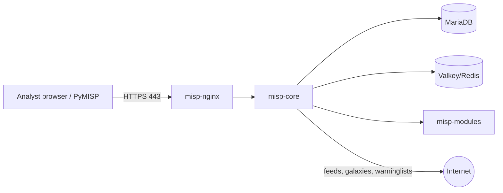

# MISP deployment guide (Docker)

We deployed MISP locally with the **official `misp-docker` project**:
https://github.com/MISP/misp-docker. It runs MISP as separate containers:

| Container | Role |
|---|---|
| `misp-core` | MISP web application (PHP, CakePHP) + background workers |
| `misp-nginx` | Web server / TLS termination (ports 80 / 443) |
| `misp-modules` | Enrichment, import and export modules |
| `db` (MariaDB 10.11) | Events, attributes, users |
| `redis` (Valkey) | Cache and job queue |
| `mail` | Local SMTP relay for notifications |



## Requirements
- Docker Desktop (Windows/macOS, WSL2 backend on Windows) or Docker Engine 25+ with Compose 2.17+ on Linux
- At least **4 GB RAM** free for Docker, ~10 GB disk

## 1. Install and start

```bash
git clone https://github.com/MISP/misp-docker.git
cd misp-docker
cp template.env .env          # Windows PowerShell: Copy-Item template.env .env
```

Optional edits in `.env`:
```ini
BASE_URL=https://localhost
ADMIN_EMAIL=admin@admin.test
ADMIN_ORG=CTI-Lazarus-Group
# if ports 80/443 are busy:
# NGINX_HTTP_PORT=8080
# NGINX_HTTPS_PORT=8443   (then BASE_URL=https://localhost:8443)
```

```bash
docker compose pull           # download pre-built images
docker compose up -d          # start in background
docker compose ps             # all services should be "running"/"healthy" (first start takes ~3-5 min)
docker compose logs -f misp-core   # watch initialisation, Ctrl+C to exit
```

📸 Screenshot: `images/misp-docker-ps.png` (output of `docker compose ps`)

## 2. First login
1. Open **https://localhost** and accept the self-signed certificate warning.
2. Log in with `admin@admin.test` / `admin`. MISP forces a password change.
3. Rename the organisation (Administration → List Organisations) to your group name.

📸 Screenshot: `images/misp-dashboard.png`

## 3. Load knowledge bases (enrichment context)

| What | Where in the menu | Why |
|---|---|---|
| Galaxies | Galaxies → List Galaxies → **Update Galaxies** | Threat actors (Lazarus), ransomware (WannaCry), MITRE ATT&CK |
| Taxonomies | Event Actions → List Taxonomies → **Update Taxonomies**, then enable `tlp` | TLP 2.0 tags (`tlp:clear`) |
| Warninglists | Input Filters → List Warninglists → **Update Warninglists**, then enable them | Filters false positives (Google DNS, Microsoft domains, sinkholes…) |
| Object templates | List Object Templates → **Update Objects** (usually pre-loaded) | `file` object used for hash grouping |
| OSINT feed | Sync Actions → Feeds → **Load default feed metadata**, enable *CIRCL OSINT Feed*, then **Fetch and store all feed data** | Correlation of our IOCs against a public community feed |

## 4. Create an API key
Administration → List Auth Keys → **Add authentication key** (user: admin). Copy the key: it is shown only once.

## 5. Import our IOCs

```bash
cd week3-data-processing
python3 -m venv .venv && source .venv/bin/activate     # Windows: .venv\Scripts\activate
pip install -r requirements.txt

python3 scripts/normalize_iocs.py                       # raw -> normalized CSV

export MISP_URL=https://localhost                       # PowerShell: $env:MISP_URL="https://localhost"
export MISP_KEY=<api key>                               # PowerShell: $env:MISP_KEY="<api key>"
python3 scripts/push_to_misp.py --insecure              # --insecure = self-signed lab certificate
```

**Alternative without the API:** `python3 scripts/push_to_misp.py --offline` writes
`data/wannacry_misp_event.json`. In MISP, go to **Event Actions → Import from…** and choose the *MISP standard (JSON)* format, then upload it.

📸 Screenshots: `images/push-output.png`, `images/misp-event.png`, `images/misp-attributes.png`,
`images/misp-galaxy.png`, `images/misp-correlation.png`

## 6. Stop / reset
```bash
docker compose stop        # stop, keep data
docker compose down -v     # remove containers AND volumes (full reset)
```

## Troubleshooting
- **Port already in use**: change `NGINX_HTTP_PORT` / `NGINX_HTTPS_PORT` and `BASE_URL` in `.env`.
- **Login page loops / wrong redirects**: `BASE_URL` must match exactly the URL in your browser (including the port).
- **`PyMISPError: Unable to connect`**: check the URL (https), the key, and use `--insecure` for the self-signed certificate.
- **Galaxy tags show as plain tags**: run *Update Galaxies* first, then re-import.
