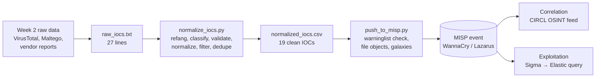
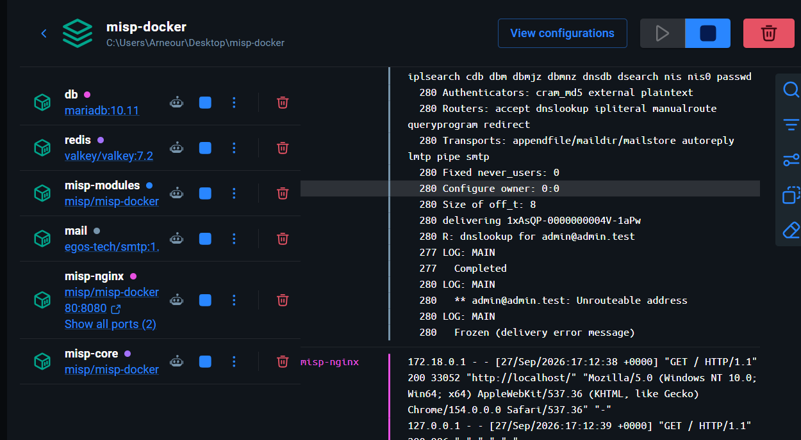
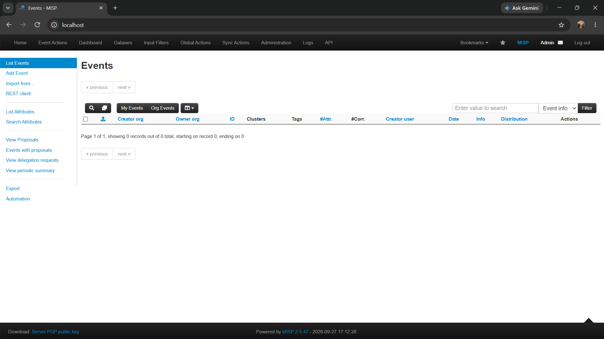
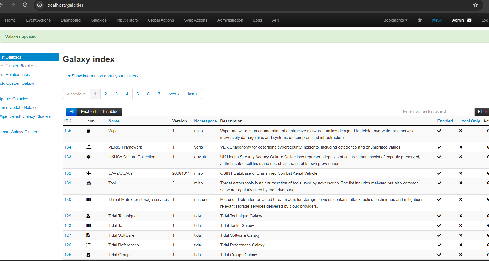
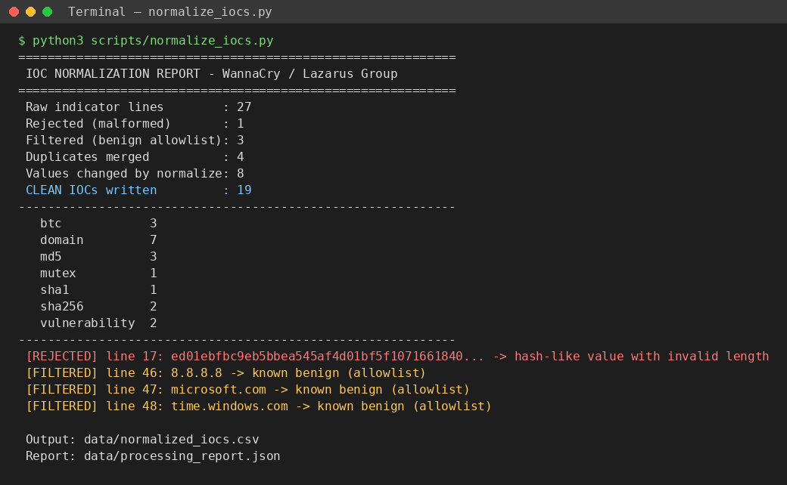
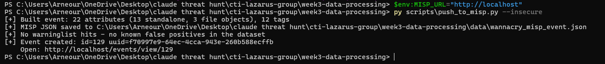
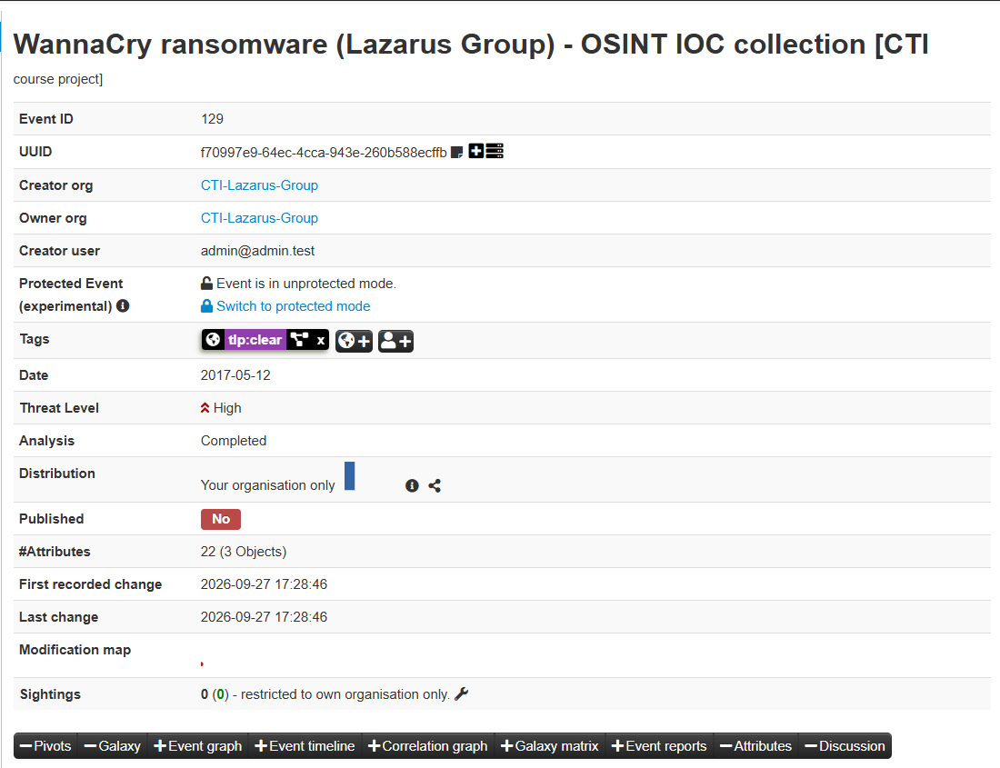
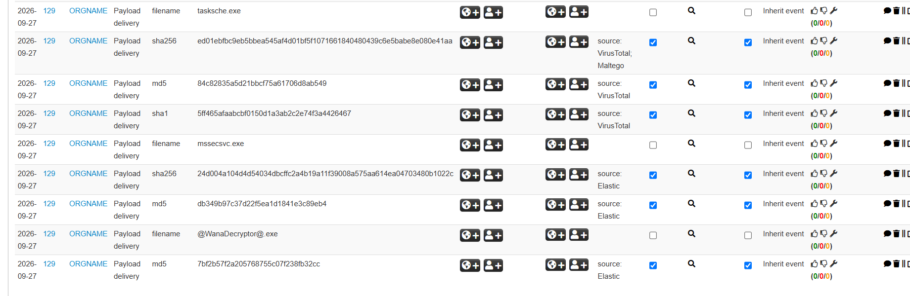
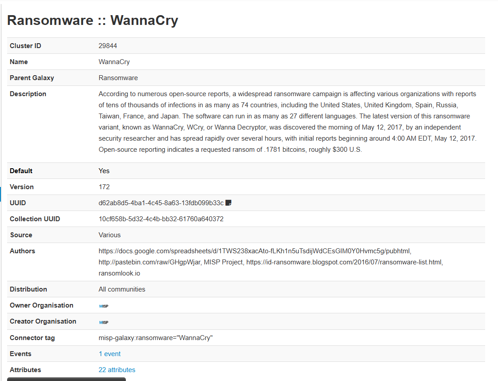

# Week 3 — Data Processing and Exploitation: Lazarus Group / WannaCry

**Syllabus tasks (section 3.3, Week 3):**
1. Deploy MISP and import IOCs.
2. Apply filtering and normalization techniques to collected data.

**Lecture topics covered:** data enrichment, correlation, tools (MISP, Elastic Stack, Sigma rules).

| Folder / file | Content |
|---|---|
| [`DEPLOYMENT.md`](DEPLOYMENT.md) | Step-by-step MISP deployment with Docker |
| [`data/raw_iocs.txt`](data/raw_iocs.txt) | Raw IOCs as collected in Week 2 (unprocessed) |
| [`scripts/normalize_iocs.py`](scripts/normalize_iocs.py) | Filtering and normalization pipeline |
| [`data/normalized_iocs.csv`](data/normalized_iocs.csv) | Clean dataset (output) |
| [`data/processing_report.json`](data/processing_report.json) | Statistics, rejected and filtered values |
| [`scripts/push_to_misp.py`](scripts/push_to_misp.py) | IOC import into MISP via the REST API (PyMISP) |
| [`data/wannacry_misp_event.json`](data/wannacry_misp_event.json) | The event in MISP JSON format (portable, importable) |
| [`sigma/wannacry_recovery_inhibition.yml`](sigma/wannacry_recovery_inhibition.yml) | Detection rule built from the processed intelligence |
| [`scripts/sigma_to_elastic.py`](scripts/sigma_to_elastic.py) | Converts the Sigma rule into an Elastic query |

---

## 1. Processing pipeline overview



---

## 2. MISP deployment

MISP was deployed **locally with Docker** using the official
[`misp-docker`](https://github.com/MISP/misp-docker) project (6 containers: core, nginx, modules,
MariaDB, Valkey/Redis, mail). Installed version: **MISP 2.5.47**. Full commands are in [`DEPLOYMENT.md`](DEPLOYMENT.md).

```bash
git clone https://github.com/MISP/misp-docker.git && cd misp-docker
cp template.env .env
docker compose pull && docker compose up -d
```



After the first login we loaded the context that MISP uses for enrichment:
**galaxies** (threat actors, ransomware, MITRE ATT&CK), **taxonomies** (TLP 2.0),
**warninglists** (false-positive lists) and the **CIRCL OSINT feed** (for correlation).





---

## 3. Filtering and normalization

Raw OSINT data is messy. The same indicator appears in different forms depending on the source.
[`normalize_iocs.py`](scripts/normalize_iocs.py) applies 8 steps:

| # | Technique | What it does | Example from our data (before → after) |
|---|---|---|---|
| 1 | **Parsing** | Separates the indicator from source notes and metadata (`file=`, `role=`) | `…41aa # VirusTotal \| file=tasksche.exe` → value + source + file name |
| 2 | **Refanging** | Reverses "defanging" used in reports so tools can process values | `hxxp://www[.]iuqerfsodp9…[.]com` → `iuqerfsodp9…wea.com` |
| 3 | **Type classification** | Detects the MISP attribute type with regular expressions | 64 hex → `sha256`, `CVE-…` → `vulnerability`, Base58 → `btc` |
| 4 | **Validation** | Rejects malformed values | 63-char "SHA256" (copy-paste error) → **rejected** |
| 5 | **Case normalization** | Lower-cases hashes/domains, upper-cases CVE ids. **Bitcoin addresses are kept as they are**: Base58 is case-sensitive, and lower-casing would create a different, invalid wallet | `ED01EBFB…` → `ed01ebfb…`, `cve-2017-0147` → `CVE-2017-0147` |
| 6 | **Filtering (allowlist)** | Drops known-benign infrastructure seen in sandbox noise (same idea as MISP warninglists) | `8.8.8.8`, `microsoft.com`, `time.windows.com` → **filtered** |
| 7 | **Deduplication** | Same (type, value) is kept once; sources are merged | `GX7EKBENV2RIUCMF.ONION` = `gx7ekbenv2riucmf.onion` → 1 row, 2 sources |
| 8 | **Enrichment for MISP** | Adds category, `to_ids` flag, comment, file-object grouping | Hashes of `tasksche.exe` grouped into one `file` object |

### Result



| Metric | Value |
|---|---|
| Raw indicator lines | 27 |
| Rejected (malformed) | 1 |
| Filtered (benign) | 3 |
| Duplicates merged | 4 |
| **Clean IOCs** | **19** (7 domains incl. 5 `.onion`, 3 MD5, 2 SHA256, 1 SHA1, 3 BTC, 2 CVE, 1 mutex) |

### Analyst decisions (important!)

1. **Kill-switch domains are stored with `to_ids = false` and tagged `kill-switch`.**
   WannaCry *stops* if it can reach `iuqerfsodp9ifjaposdfjhgosurijfaewrwergwea.com`. If a defender
   blocked this domain in DNS or the firewall (a normal reaction to a "malicious domain"),
   the malware could no longer reach it and **would start encrypting**. The correct action is to
   **monitor** DNS lookups for this domain as a sign of infection, never to block it. This shows why
   IOCs need context and cannot be blindly exported to blocklists.
2. **All three hash types (MD5, SHA1, SHA256) are kept**, grouped in one MISP `file` object per
   component. Different security tools and feeds use different hash types, so keeping all of them
   makes correlation more likely. The object makes it clear they describe the *same* file.
3. **CVEs are `to_ids = false`**: a CVE is context, not something an IDS can match on network traffic.
4. **TLP:CLEAR** (TLP 2.0 name for the former TLP:WHITE): all data comes from public sources.

---

## 4. IOC import into MISP

The clean CSV was imported with [`push_to_misp.py`](scripts/push_to_misp.py) (PyMISP, MISP REST API).
Before upload the script asks MISP's **warninglists** whether any value is a known false positive.



The event was created as **event #129**. The warninglist check returned **no hits**. This is expected:
the benign values (`8.8.8.8`, `microsoft.com`, `time.windows.com`) had already been removed by our own
filtering step, so MISP independently confirmed that the cleaned dataset contains no known false positives.

**Event:** *WannaCry ransomware (Lazarus Group) - OSINT IOC collection*
- Date 2017-05-12 · Threat level **High** · Analysis **Completed** · Distribution *Your organisation only*
- 22 attributes: 3 `file` objects (dropper, encryptor, decryptor) + 13 standalone attributes





In the attribute list, each `filename` row starts a `file` object (`tasksche.exe`, `mssecsvc.exe`,
`@WanaDecryptor@.exe`), followed by its hashes. Hashes have the **IDS flag enabled** (usable for detection),
while file names do not (too easy to rename, too many false positives).

---

## 5. Enrichment and correlation

**Galaxy enrichment.** Instead of typing publicly known context by hand, the event is linked to
MISP galaxy clusters:

| Galaxy | Cluster |
|---|---|
| Threat actor | Lazarus Group |
| MITRE intrusion set | Lazarus Group - G0032 |
| Ransomware | WannaCry |
| MITRE malware | WannaCry - S0366 |
| MITRE ATT&CK techniques | T1210, T1486, T1490, T1090.003, T1543.003, T1222.001, T1564.001 |



The cluster page for **Ransomware :: WannaCry** shows the context MISP added for free (description,
ransom amount, authors, connector tag `misp-galaxy:ransomware="WannaCry"`). It also shows our event and its
22 attributes under *Events / Attributes*, which proves the link works both ways.

**Correlation.** MISP automatically compares every new attribute with all other events and with cached
feeds (e.g. the CIRCL OSINT feed). When the same value exists elsewhere, it is shown in the *#Corr.*
column and as *Related events / Feed hits*. This confirms our data independently and links our event to
other analysts' work. Correlation is also why normalization matters: `ED01EBFB…` and `ed01ebfb…` would
never correlate if they were stored as-is.

---

## 6. Exploitation: from IOCs to detection

Hashes sit at the bottom of the *Pyramid of Pain*: a recompiled sample defeats them. We therefore
also turned WannaCry's **behaviour** (documented in the same vendor reports) into a
**Sigma rule**: [`sigma/wannacry_recovery_inhibition.yml`](sigma/wannacry_recovery_inhibition.yml).
It detects shadow-copy deletion, backup-catalog deletion, boot-recovery disabling (T1490) and the
`icacls . /grant Everyone:F /T` permission change (T1222.001).

Converted to an **Elastic (Lucene)** query with pySigma (`python3 scripts/sigma_to_elastic.py`):

```
(Image:*\\vssadmin.exe AND (CommandLine:*delete* AND CommandLine:*shadows*)) OR
(Image:*\\wmic.exe AND (CommandLine:*shadowcopy* AND CommandLine:*delete*)) OR
(Image:*\\wbadmin.exe AND (CommandLine:*delete* AND CommandLine:*catalog*)) OR
(Image:*\\bcdedit.exe AND (CommandLine:(*recoveryenabled\ no* OR *bootstatuspolicy\ ignoreallfailures*))) OR
(Image:*\\icacls.exe AND (CommandLine:*\/grant* AND CommandLine:*Everyone\:F* AND CommandLine:*\/T*))
```

This query can be pasted into Kibana. It will be used in Week 5 (hunting in Splunk/ELK).

---

## 7. Summary

| CTI lifecycle phase | What we did |
|---|---|
| Collection (Week 2) | VirusTotal, Maltego, Shodan, vendor reports |
| **Processing (Week 3)** | Refang → classify → validate → normalize → filter → deduplicate (27 → 19 IOCs) |
| **Storage and enrichment** | MISP event with file objects, galaxies (Lazarus, WannaCry, ATT&CK), TLP |
| **Correlation** | Warninglist check + CIRCL OSINT feed correlations |
| **Exploitation** | Sigma rule → Elastic query; kill-switch handled as *monitor, don't block* |

**How to reproduce:** see [`DEPLOYMENT.md`](DEPLOYMENT.md).

## Sources
- MISP Project documentation and training: https://www.misp-project.org/documentation/ , https://www.circl.lu/services/misp-training-materials/
- misp-docker: https://github.com/MISP/misp-docker
- PyMISP: https://github.com/MISP/PyMISP
- MISP galaxy clusters: https://github.com/MISP/misp-galaxy
- MISP warninglists: https://github.com/MISP/misp-warninglists
- Sigma specification: https://github.com/SigmaHQ/sigma-specification
- Elastic — WannaCry technical analysis: https://www.elastic.co/blog/wcrywanacry-ransomware-technical-analysis
- FIRST — TLP 2.0: https://www.first.org/tlp/
