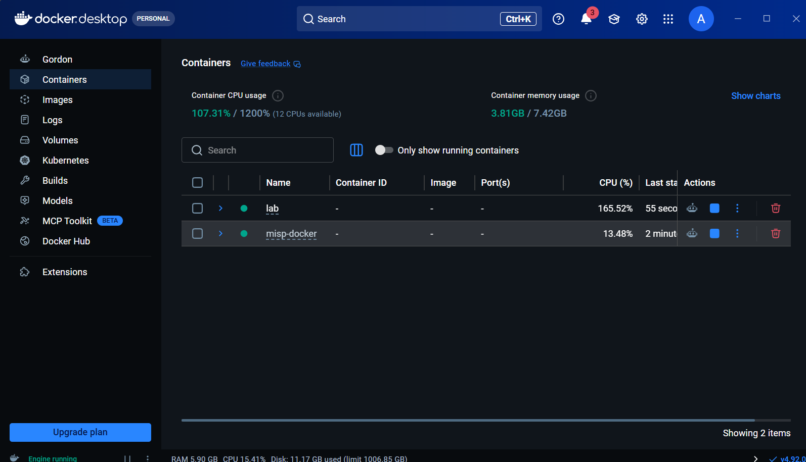
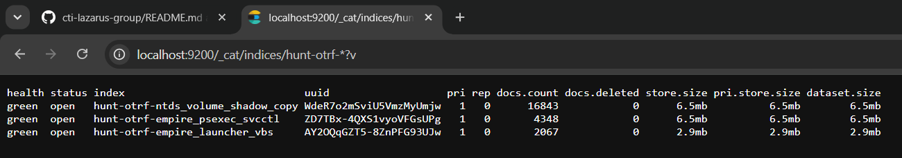
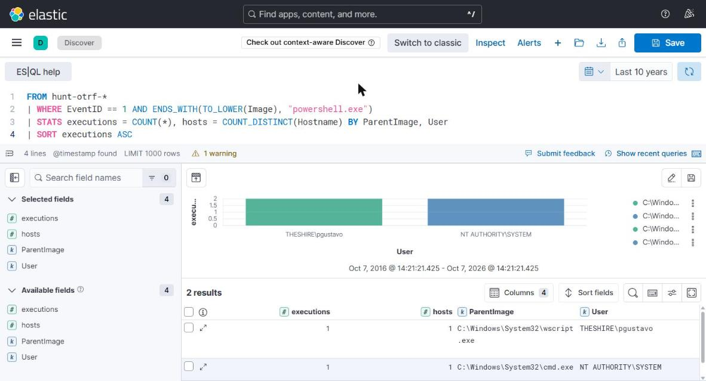
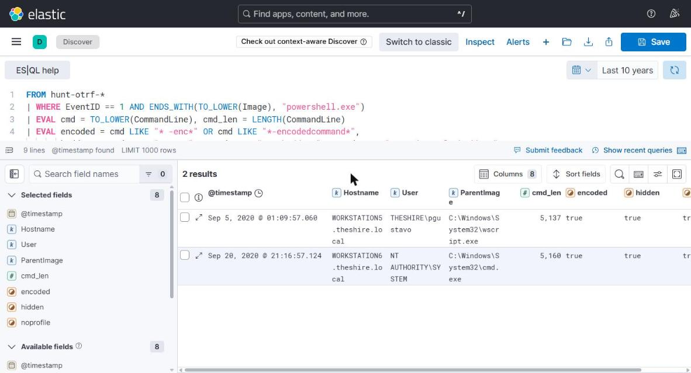
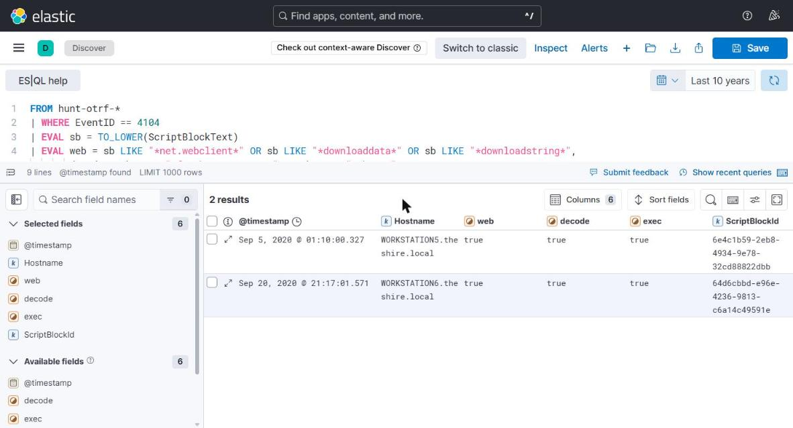
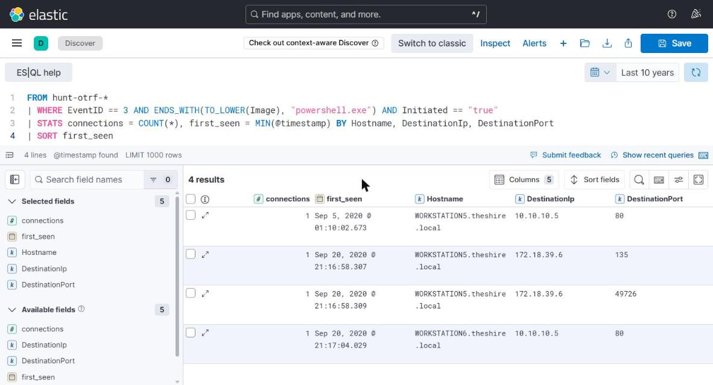
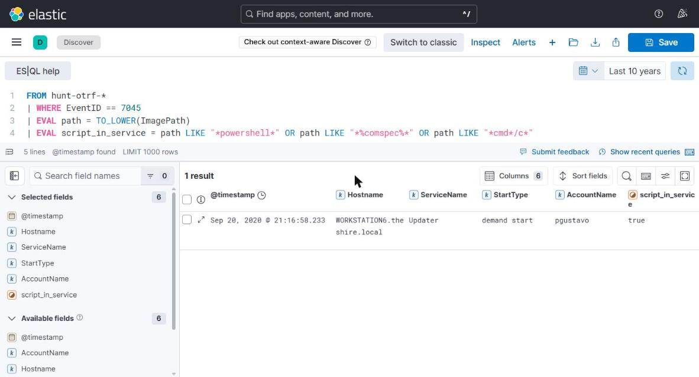
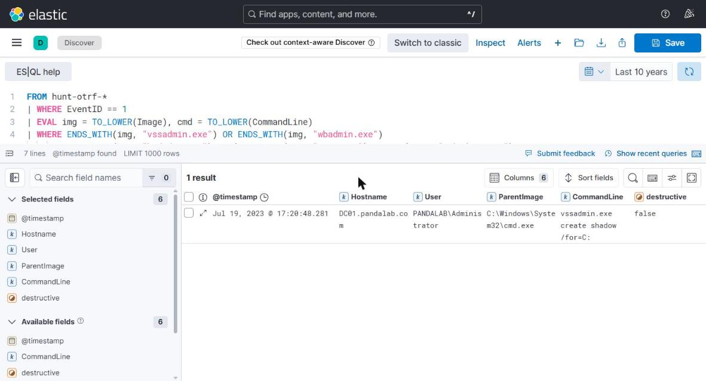
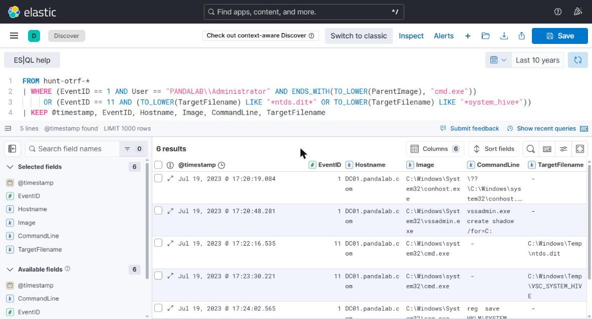

# Week 5 — Threat Hunting Concepts: hypothesis-driven and intel-driven hunts in ELK

## Objective
Learn the main threat hunting models, then run two real hunts in Elasticsearch:

- **H1 (hypothesis-driven):** suspicious PowerShell activity, the scenario from the syllabus.
- **H2 (intel-driven):** WannaCry / Lazarus behaviour taken from our week 3 MISP event and the week 4 Kill Chain mapping.

All data is **real Windows telemetry** from the public
[OTRF Security-Datasets](https://github.com/OTRF/Security-Datasets) project
(Sysmon, Security, PowerShell logs recorded while known adversary techniques
were executed in a lab). We did not generate or modify any events.

---

## 1. What threat hunting is

Threat hunting is the **proactive, human-led, iterative search** for
adversaries that are already inside the network and were **not** caught by
existing alerts. Detection waits for an alert; hunting starts from a question.

| | Detection (SOC alerting) | Threat hunting |
|---|---|---|
| Trigger | Rule or signature fires | Analyst question / hypothesis / new intel |
| Assumption | "We know what bad looks like" | "Something got past our rules" |
| Output | Alert → incident | Findings, new detections, visibility gaps |
| Success = | Alert was true positive | We learned something, even if nothing malicious was found |

### The hunting loop (Sqrrl)
`Create hypothesis → Investigate with tools → Uncover patterns & TTPs → Inform and enrich analytics → (new hypothesis)`

The last step is what makes hunting pay off: every hunt should leave behind an
automated detection, so the same thing never needs to be hunted manually again.

### Hunting models

| Model | Starts from | Example in this project |
|---|---|---|
| **Intel-driven** | Threat intelligence: IOCs, TTPs of a known actor, a new report | H2: sweep for WannaCry hashes, kill-switch domain, `vssadmin delete`, `mssecsvc2.0` |
| **Hypothesis-driven** | An analyst's educated guess about adversary behaviour, usually tied to ATT&CK | H1: "an adversary is running hidden, encoded PowerShell launched by an unusual parent" |
| **Situational / entity-driven** | Crown jewels, risk assessment (who/what is most valuable) | Not done; would start from the domain controller `DC01` |
| **Baseline / data-driven** | Statistics: what is normal, what is rare (stacking, long tail) | Used inside H1: stack count of PowerShell parents |

### PEAK framework (Splunk SURGe, 2023)
**P**repare → **E**xecute → **A**ct, with **K**nowledge at every step.
Three hunt types: *hypothesis-driven*, *baseline* (exploratory data analysis)
and *model-assisted* (M-ATH, machine learning). PEAK suggests writing the
hypothesis in **ABLE** form: **A**ctor, **B**ehavior, **L**ocation, **E**vidence.
We use ABLE for both hunts below.

Other frameworks worth knowing: **TaHiTI** (Dutch financial sector, 2018:
Initiate → Hunt → Finalize) and the **Hunting Maturity Model** (Section 7).

### Link to the Pyramid of Pain (weeks 3–4)
H2 starts at the bottom (hashes, domain): cheap to check, easy for the
adversary to change. H1 works at the top (TTP: *how* PowerShell is used),
which is hard for the adversary to change. A good hunting program uses both.

---

## 2. Lab

```
OTRF Security-Datasets (JSON)  ──download_datasets.py──►  lab/data/*.json
                                                             │
                                          load_to_elastic.py │ (_bulk API)
                                                             ▼
                        Elasticsearch 8.19 (Docker)  ◄──── Kibana Discover / ES|QL
                                                             │
                       hunts/*.esql  (queries)  ─────────────┘
                       hunts/hunt_offline.py  (same logic in Python, no ELK needed)
```

### Datasets

| Index | Original dataset | Environment | What was simulated |
|---|---|---|---|
| `hunt-otrf-empire_launcher_vbs` | `execution/host/empire_launcher_vbs` | theshire.local, Sep 2020 | User opens a VBS file → Empire PowerShell launcher |
| `hunt-otrf-empire_psexec_svcctl` | `lateral_movement/host/empire_psexec_dcerpc_tcp_svcctl` | theshire.local, Sep 2020 | PsExec-style lateral movement WORKSTATION5 → WORKSTATION6 via a remote service |
| `hunt-otrf-ntds_volume_shadow_copy` | `credential_access/host/cmd_dumping_ntds_dit_file_volume_shadow_copy` | pandalab.com, Jul 2023 | Domain admin copies the AD database out of a Volume Shadow Copy |

23,258 events in total; most of them are normal background noise
(Sysmon process access, registry, image loads, Windows services).

> **Honesty note.** These are three separate recordings. The first two come
> from the same lab domain but were recorded two weeks apart. We analyze them
> as one environment to practise hunting, but we do not claim they are one
> continuous intrusion. Real hunts run over weeks of data from thousands of
> hosts; our stack counts are therefore very small.

### How to run (Windows, Docker Desktop)
```powershell
cd week5-threat-hunting\lab
docker compose up -d                      # Elasticsearch + Kibana, ~2 min
python download_datasets.py               # ~50 MB of JSON into lab\data\
python load_to_elastic.py                 # creates indices hunt-otrf-*
# Kibana: http://localhost:5601 -> Discover -> "Try ES|QL" -> paste queries from ..\hunts\
```
No ELK? `python hunts\hunt_offline.py` runs the same hunts directly on the
JSON files. Its full output is in [`results/hunt_results.md`](results/hunt_results.md).

`lab/data/` is not committed (`.gitignore`): anyone can re-download it with the script.




---

## 3. Hunt H1 — Suspicious PowerShell (hypothesis-driven)

### Prepare
**Hypothesis (ABLE):**

| | |
|---|---|
| **Actor** | Lazarus-style intrusion set; Lazarus uses PowerShell for execution and discovery (ATT&CK G0032, T1059.001) |
| **Behavior** | PowerShell started with a hidden window and an encoded command, by a parent that does not normally start PowerShell; the script downloads and decodes a second stage |
| **Location** | Windows workstations in the domain |
| **Evidence** | Sysmon EID 1 (process creation with command line), PowerShell EID 4104 (Script Block Logging), Sysmon EID 3 (network), System EID 7045 (new service) |

**Why this hypothesis:** in week 4 we saw that hashes are at the bottom of the
Pyramid of Pain. PowerShell abuse is one of the most common TTPs across all
actors, and normal admin use looks different (signed scripts, `-File`,
visible window, known parents).

### Execute — queries: [`hunts/H1_powershell.esql`](hunts/H1_powershell.esql)

| Step | Technique | What it looks for |
|---|---|---|
| H1.1 | Stacking (long tail) | Count PowerShell starts by `ParentImage` + `User`; rare combinations first |
| H1.2 | Command-line analysis | `-enc` / `-EncodedCommand`, `-w 1` / `-w hidden`, `-nop` |
| H1.3 | Script Block Logging | Decoded script contains `Net.WebClient`, `DownloadData`, `FromBase64String`, `-bxor` |
| H1.4 | Process tree | What did PowerShell start next? |
| H1.5 | Pivot | Where did a **SYSTEM** PowerShell come from? → new services (7045) |
| H1.6 | Network | Does PowerShell talk to the network? |

### Results

**H1.1 + H1.2 — only two PowerShell executions, both suspicious:**

| Time (UTC) | Host | User | Parent | Cmd length | Encoded | Hidden |
|---|---|---|---|---|---|---|
| 2020-09-04 20:09:57 | WORKSTATION5 | THESHIRE\pgustavo | **wscript.exe** | 5,137 | ✔ | ✔ |
| 2020-09-20 16:16:57 | WORKSTATION6 | **NT AUTHORITY\SYSTEM** | **cmd.exe ← services.exe** | 5,160 | ✔ | ✔ |

Both command lines are `powershell -noP -sta -w 1 -enc <5,000 chars of Base64>`.
This flag combination is the default launcher of the **PowerShell Empire**
post-exploitation framework.




**H1.3 — Script Block Logging shows what the Base64 really was.** One 4104
event per host (≈1,900 chars) containing a web client, Base64 decoding, an
XOR routine and `IEX`. In other words, a **stager** that downloads the next
stage, decrypts it in memory and executes it. The script uses rAnDoM
cAsE (`$PSVERSiOnTaBlE`) to break simple signatures (T1027.010 Command
Obfuscation), and references internal `System.Management.Automation`
classes, which is typical of AMSI / logging bypass attempts.



**H1.4 — post-exploitation:** on both hosts the PowerShell process started
`whoami.exe` (T1033 System Owner/User Discovery). This is the first thing an
operator does after a new session: "who am I running as?"

**H1.6 — C2:** PowerShell on both hosts connected to **10.10.10.5:80**,
about 6 seconds after it started (T1071.001 Web Protocols).



**H1.5 — pivot, how did WORKSTATION6 get a SYSTEM PowerShell?**

| Time (UTC) | Host | Evidence | Meaning |
|---|---|---|---|
| 16:16:58.212 | WORKSTATION6 | 4624 logon type 3, `pgustavo` from 172.18.39.5 (WORKSTATION5) | Network logon with stolen/used credentials |
| 16:16:58.214 | WORKSTATION6 | 4697 / 7045 service **`Updater`**, demand start, ImagePath = `%COMSPEC% /C start /b ... powershell -noP -sta -w 1 -enc ...` | Remote service creation (T1543.003 / T1569.002) |
| 16:16:58.222 | WORKSTATION6 | services.exe → cmd.exe → powershell.exe as SYSTEM | Service executes the launcher |
| 16:16:58.306 | WORKSTATION5 | PowerShell resolves `WORKSTATION6`, connects to TCP 135 and 49726 (RPC → svcctl) | Source of the lateral movement (T1021 / PsExec-style) |
| 16:17:04 | WORKSTATION6 | PowerShell → 10.10.10.5:80 | New C2 session |
| 16:17:20 | WORKSTATION6 | `whoami.exe` | Operator checks privileges: SYSTEM |

(The ~0.1 s that WORKSTATION5 appears "after" WORKSTATION6 is normal clock
skew between hosts; always correlate across hosts with a tolerance.)



### Verdict H1: **hypothesis confirmed**
Malicious PowerShell on WORKSTATION5 (user-executed VBS) and WORKSTATION6
(remote service, SYSTEM), both calling back to 10.10.10.5.

**Kill Chain view (week 4):** Delivery (`launcher.vbs` on the Desktop) →
Exploitation/Execution (wscript → PowerShell) → C2 (10.10.10.5:80) →
Actions (discovery, lateral movement to WORKSTATION6 with `pgustavo`'s
credentials).

**Response actions if this were production:** isolate both hosts, block
10.10.10.5, reset `pgustavo`'s password and check where else it was used,
collect `launcher.vbs`, hunt for service `Updater` and 4624 type 3 from
WORKSTATION5 across the domain.

---

## 4. Hunt H2 — WannaCry TTPs (intel-driven)

### Prepare
**Intel source:** our MISP event (week 3) and the ATT&CK mapping (week 4).

| | |
|---|---|
| **Actor** | Lazarus Group / WannaCry (S0366) |
| **Behavior** | Worm propagation over SMB, service `mssecsvc2.0`, permission changes, shadow copy deletion |
| **Location** | All Windows hosts, especially servers with SMB exposed |
| **Evidence** | Sysmon 1 (hashes, command lines), Sysmon 22 (DNS), Sysmon 3 (port 445), 7045 (services) |

### Execute — queries: [`hunts/H2_wannacry_ttps.esql`](hunts/H2_wannacry_ttps.esql)

| Step | Pyramid level | ATT&CK | Result |
|---|---|---|---|
| H2.1 Hashes of `mssecsvc.exe`, `tasksche.exe` | Hash | — | **0 hits** in 26 hashed process events |
| H2.2 Kill-switch domain in DNS | Domain | T1071.001 | **0 hits** in 5 DNS events |
| H2.3 `vssadmin` / `wbadmin` / `bcdedit` / `wmic shadowcopy` | TTP | T1490 | **1 hit**, but `create shadow`, not `delete` → triage ⬇ |
| H2.4 `icacls Everyone:F`, `attrib +h` | TTP | T1222.001, T1564.001 | **0 hits** |
| H2.5 Service `mssecsvc2.0` / `-m security` | Host artifact | T1543.003 | **0 hits** (one other service `Updater`, already found in H1) |
| H2.6 One process → many hosts on TCP 445 | Network | T1210 | **No fan-out**: only `System` on DC01, 3 connections to 1 host (normal) |



### Triage of the H2.3 hit (H2.7)
WannaCry *deletes* shadow copies. Here someone *created* one on the domain
controller. This is not WannaCry, but it is not normal either:

| Time (UTC) | Host | Event | Detail |
|---|---|---|---|
| 12:20:48 | DC01 | Process (Sysmon 1) | `PANDALAB\Administrator`: `vssadmin.exe create shadow /for=C:` |
| 12:22:16 | DC01 | File created (Sysmon 11) | `cmd.exe` wrote **`C:\Windows\Temp\ntds.dit`** |
| 12:23:30 | DC01 | File created | `cmd.exe` wrote `C:\Windows\Temp\VSC_SYSTEM_HIVE` |
| 12:24:02 | DC01 | Process + file | `reg save HKLM\SYSTEM C:\Windows\Temp\SYSTEM_HIVE` |

`ntds.dit` + the `SYSTEM` hive = every password hash in the domain. This is
**T1003.003 OS Credential Dumping: NTDS**. The copy itself was done with the
`copy` command, which is built into `cmd.exe`, so there is no separate
process event; only the **file-creation** event shows it. Good lesson about
data sources.



### Verdict H2: **no evidence of WannaCry**, one unrelated high-severity finding
A negative result is still a result: we can state with evidence that the
WannaCry IOCs and TTPs from our intel are absent in this data. While pivoting
on one TTP (`vssadmin`) we found **credential theft from the domain
controller**. This is typical of intel-driven hunting: the intel points you
to the right data, and the data shows you something else.

---

## 5. Act with Knowledge: what we leave behind

### New detection (Sigma)
[`sigma/script_host_spawns_hidden_encoded_powershell.yml`](sigma/script_host_spawns_hidden_encoded_powershell.yml):
`wscript|cscript|mshta → powershell|pwsh` with encoded command or hidden window.

Converted with `sigma convert -t esql` (pySigma Elasticsearch backend). Note:
Sigma matching is case-insensitive, but the generated ES|QL is not (the dataset
has `WScript.exe` with capitals), so in Kibana wrap fields in `TO_LOWER()`:

```esql
FROM hunt-otrf-*
| WHERE EventID == 1
  AND (ENDS_WITH(TO_LOWER(ParentImage), "\\wscript.exe") OR ENDS_WITH(TO_LOWER(ParentImage), "\\cscript.exe") OR ENDS_WITH(TO_LOWER(ParentImage), "\\mshta.exe"))
  AND (ENDS_WITH(TO_LOWER(Image), "\\powershell.exe") OR ENDS_WITH(TO_LOWER(Image), "\\pwsh.exe"))
  AND (TO_LOWER(CommandLine) LIKE "* -enc*" OR TO_LOWER(CommandLine) LIKE "* -w 1*" OR TO_LOWER(CommandLine) LIKE "* -w hidden*")
```

It fires on WORKSTATION5 and **not** on WORKSTATION6. The second case needs
another rule: "service ImagePath contains PowerShell / `%COMSPEC%`" (H1.5).
Together with the week 3 Sigma rule for shadow-copy deletion, this covers
both hunts.

### Visibility notes
| Data source | Why it mattered |
|---|---|
| PowerShell **Script Block Logging (4104)** | Without it we would only see Base64; 4104 showed download + decode + IEX |
| Sysmon **11 (file create)** | The only evidence of the `ntds.dit` copy |
| Sysmon **1** with **hashes** | Makes IOC sweeps (H2.1) possible at all |
| Security **4624 / 4697** | Linked the service on WORKSTATION6 to `pgustavo` from WORKSTATION5 |

### Hunting backlog (next hypotheses)
1. Other hosts with logon type 3 by `pgustavo` from WORKSTATION5.
2. Any other host connecting to 10.10.10.5.
3. Who else ran `vssadmin create shadow` or wrote `ntds.dit` on any DC?

---

## 6. ATT&CK techniques found (v19)

| Technique | Where |
|---|---|
| T1059.005 Visual Basic | `launcher.vbs` via wscript.exe (WS5) |
| T1059.001 PowerShell | Encoded launcher (WS5, WS6) |
| T1027.010 Command Obfuscation (Stealth) | Base64 + random case in script block |
| T1071.001 Web Protocols | PowerShell → 10.10.10.5:80 |
| T1033 System Owner/User Discovery | `whoami.exe` |
| T1021 / T1569.002 Remote Services / Service Execution | Service `Updater` created remotely on WS6 |
| T1543.003 Windows Service | `Updater` |
| T1078 Valid Accounts | `pgustavo` used for the network logon |
| T1003.003 OS Credential Dumping: NTDS | `vssadmin create shadow` + `ntds.dit` copy (DC01) |

---

## 7. Hunting Maturity Model (Bianco, Sqrrl 2015): where are we?

| Level | Description | Us |
|---|---|---|
| HMM0 Initial | Relies only on automated alerts | |
| HMM1 Minimal | Searches for IOCs from threat intel | H2.1, H2.2 |
| HMM2 Procedural | Follows hunting procedures written by others | H1 / H2 use published TTPs |
| HMM3 Innovative | Creates own procedures, uses data analysis (stacking) | H1.1 stacking, H2.7 pivot |
| HMM4 Leading | Automates successful hunts into detections | Sigma rule from H1 |

We touch HMM3–4 in method, but realistically a student lab is **HMM2**: one
analyst, small data, no continuous hunting program.

---

## 8. Screenshots (`images/`)
Kibana screenshots were taken from our ELK lab (Kibana 8.19, Discover → ES|QL,
time range "Last 10 years"). Kibana shows times in local time (UTC+5); the
tables in this README use UTC.

| File | What |
|---|---|
| `docker-ps.png` | Docker Desktop: compose project `lab` (Elasticsearch + Kibana) running |
| `es-indices.png` | `_cat/indices`: 3 indices, 23,258 events loaded |
| `h1-stacking.png` | H1.1 stack count |
| `h1-flags.png` | H1.2 launcher flags |
| `h1-scriptblock.png` | H1.3 script blocks |
| `h1-c2.png` | H1.6 PowerShell network connections |
| `h1-service.png` | H1.5 service `Updater` |
| `h2-recovery.png` | H2.3 `vssadmin create shadow` |
| `h2-ntds.png` | H2.7 `ntds.dit` triage |

---

## Sources
- SANS — threat hunting definition and SANS Threat Hunting Summit talks
- Sqrrl / D. Bianco — *A Framework for Cyber Threat Hunting* (hunting loop, Hunting Maturity Model), 2015–2016
- Splunk SURGe — *PEAK Threat Hunting Framework*, 2023
- FI-ISAC NL — *TaHiTI: Targeted Hunting integrating Threat Intelligence*, 2018
- Microsoft — threat hunting guidance (Microsoft Defender advanced hunting)
- Course reading: P. Smith, *Practical Threat Hunting*
- OTRF Security-Datasets — github.com/OTRF/Security-Datasets
- MITRE ATT&CK v19 — G0032 Lazarus Group, S0366 WannaCry, T1059.001, T1003.003
- Elastic — ES|QL reference; SigmaHQ / pySigma
